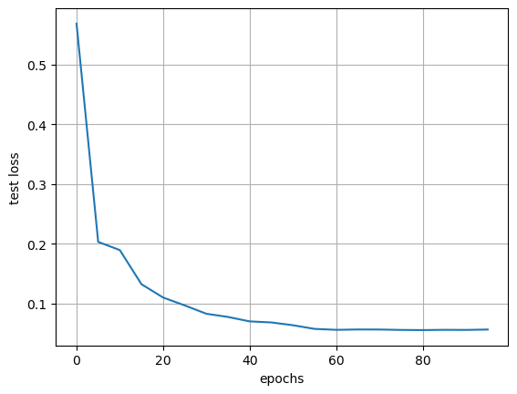
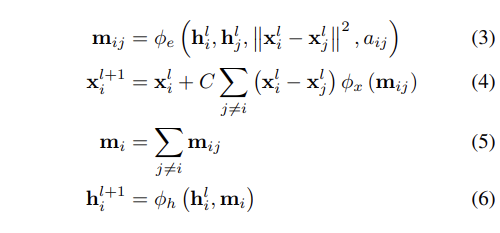

# Baseline Model

## E(n) Equivariant Graph Neural Networks
Victor Garcia Satorras, Emiel Hogeboom, Max Welling <br>
[](https://arxiv.org/pdf/2102.09844.pdf)

[Official Implementation](https://github.com/vgsatorras/egnn)

This paper introduces a new model to learn graph neural networks equivariant
to rotations, translations, reflections and permutations called E(n)- Equivariant
Graph Neural Networks (EGNNs). In contrast with existing methods, this work
does not require computationally expensive higher-order representations in in-
termediate layers while it still achieves competitive or better performance. In
addition, whereas existing methods are limited to equivariance on 3 dimensional
spaces, this model is easily scaled to higher-dimensional spaces.

The E(n) Equivariant Graph Neural Network preserves equivariance to rota-
tions and translations on a set of n-dimensional coordinates and it also preserves
equivariance to permutations on the set of nodes in the same fashion as GNNs.

The dataset to be used is QM9 which has molecules with their 3D coordinates.
The input to the model is the 3D coordinates of each atom and an embedding
of the atom properties.

Multi-head attention can be incorporated in the model and XGBoost is to be
used as a output layer to the model.

We aim to make a multi-head attention E(n) Equivariant GNN with XGBoost
as a output layer.

## Baseline Results

Number of Message Passing Layers: 7 <br>
Number of epochs: 1000 <br>
Learning rate: 0.0005 <br>
Number of Features: 128

Best Test Loss: 0.05602136177922785




# Model Architecture

The model architecture consists of 7 message passing layers and in between each message passing layer, the proposed architecture has an attention mechanism which learns important features for the node and edge features. The output layer to the model is replaced by an XGBoost layer.

Please refer to the project report for more details.



# Implementation Details

The environment setup to run the model can be obtained by referring to the environment of the baseline model on their github repository.

To run the model for predicting dipole moment vectors:
```python
python -u main_qm9.py --num_workers 2 --lr 5e-4 --property mu --exp_name exp_1_mu
```
